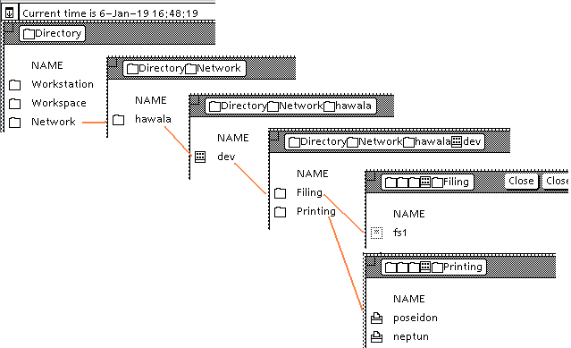

## Clearinghouse configuration

The following properties define the characteristics of a combined Clearinghouse
and Authentication service in the Dodo configuration file:

- `startChsAndAuthServices`    
do start Dodo's Clearinghouse service and Authentication service? (both can only
be started (or not) together, as they serve the same domain jointly)    
_optional_, _default_: `true`

- `organization`    
the name of the organization to be handled (served) by the clearinghouse and
authentication services    
_optional_, _default_: `hawala`

- `domain`    
the name of the domain to be handled (served) by the clearinghouse and
authentication services    
_optional_, _default_: `dev`

- `chsDatabaseRoot`    
the name of the directory where the property files defining the objects known
in the clearinghouse database for `domain:organization` are located;
the format of the property files for the different object types is defined
in the next section **_Clearinghouse database_** in this document;    
if no value is specified (or it is invalid), then no users or services are
defined, but all user names are accepted, with the password being the user name
(case-insensitive) given for login    
_optional_ (no default)

- `allowBlanksInObjectNames`    
when producing the clearinghouse object name from the filename of the object's `.properties`
file, blanks are removed by default from the object name; setting this property to `true`
will preserve the blanks    
_optional_, _default_: `false`

- `authSkipTimestampChecks`    
setting this parameter to `true` will suppress the timestamp verification steps
when verifying strong keys for authentication, allowing to logon to services
even if clocks are not synchronized for all machines on the network.    
(this parameter is intended to be used with DarkStar, which has network support
since version 1.0.0.1, but possibly has deviating time settings depending on the
timezone resp. settings for the hosting OS, e.g. due to Y2K compatibility restrictions)    
_optional_, _default_: `false`

Remark: If `startChsAndAuthServices` is `true`, then specifying the optional command
line parameter `-dumpchs` will dump the content of the Clearinghouse database loaded
from the configuration files.

## Clearinghouse database

Dodo provides a simple read-only database used for resolving distinguished names
in the Clearinghouse service and handling passwords in the Authentication service.

The Clearinghouse items required for both services are defined through
property files, each item being defined by its own property file located in the
directory specified by the `chsDatabaseRoot` parameter of the Dodo configuration.

Based on this database, Dodo's clearinghouse and authentication services provide
all Courier operations for both protocols to allow:
- login to XDE and GlobalView
- search and query Clearinghouse for users, groups, services etc. 

Although the service implementations provide all procedures defined by the Courier
protocols, the modifying operations (create, modify, delete items, change passwords, add
or remove members on groups etc.) are rejected with error `accessRightsInsufficient`,
as the database is read-only at runtime, being exclusively defined by property files. 

The property files in this directory must follow the following naming conventions:

_kind_**~**_name_`.properties`

where the _name_ component defines the objectName of the item (automatically extended with
the domain and organization to give the three-part-name of the item) and _kind_ identifies
the type of the item defined. The _kind_ must be one of:
- `c` for a clearinghouse service
- `f` for a file service
- `m` for a mail service
- `p` for a print service
- `u` for a user
- `ug` for a user group
- `ws` for a workstation
- `ec-tty` for a external communication gateway with a TTY terminal connection
- `ec-ibm` for a external communication gateway with a 3270 terminal connection

The _name_ part should be a single word. In case of an user the _name_ will usually
define the first alias of this user (see below). All names defined in the clearinghouse
database directory belong to the same single domain supported by a Dodo server, this
domain is defined through the `domain` and `organization` parameters of the
Dodo configuration.

Examples:
- `f~fs1.properties` defines a file service with name `fs1`
- `u~motu.properties` defines an user having the alias `motu`
- `ug~staff.properties` defines the user-group `staff`

The characteristics associated with each item type are described in the document
_Clearinghouse Entry Formats_ (XSIS 168404, April 1984). The following sections
describe the parameters that can or must be specified in the property file for
each item type to define the values of these characteristics.

### Services

Services have mostly a common set of characteristics, the exception being a clearinghouse
with one additional characteristic.

The name of the service is always defined by the _name_ part of the properties filename.

The following parameters can be used in the properties file for a service:

- `description`    
the description text of the service, like the location or capabilities of a printer. If
omitted, a description will be generated    
_optional_, _default_: Service _name_, type = _number_    
(with _number_: 10000 for file service, 10001 for print service, 10004 for mail service, 10021 for clearinghouse)

- `machineId`    
the processor or machine id for the server hosting the service (in the format
HH-HH-HH-HH-HH-HH)    
_required_

- `password`    
the service password as plain text, used to generate the simple and strong hashes
for the service password; if omitted, a password is generated using the name of
the service   
_optional_, _default_: _name_`.passwd`

- `authLevel`    
specification of the authentication levels supported by the service, i.e. if the
service accepts simple and/or strong authentication credentials; must be one of
`both`, `simple`, `strong`, `none`    
_optional_, _default_ : `simple`

- `aliases`    
comma separated list of aliases for the service    
_optional_ (no default)

A clearinghouse service must have one additional parameter:

- `mailservice`    
objectName of the mail service used by this clearinghouse service    
_required_

### Users

Users in general have a firstname (given name) and a lastname (family name), which can
be given in the properties file as optional parameters. The object-name of a user is
built as follows:
- if no lastname is given, then the object-name is the _name_ part of the properties filename
- if the lastname is given, the optional firstname is prepended (separated by a blank),
resulting in the object-name; the _name_ part of the properties file is used as an alias
for the user.    
The object-name is also the description characteristic of the user.

The characteristic `lastNameIndex` defined by the clearinghouse specification is
automatically derived from the start index of the lastname in the object-name if present,
else the index is 0.

The following parameters can be used to define a user:

- `firstname`    
the firstname of the user    
_optional_ (no default)

- `lastname`    
the lastname (family name) of the user    
_optional_ (no default)

- `password`    
the user password as plain text, used to generate the simple and strong password hashes
for the user; if omitted, a password is generated using the _name_ part of
the properties file   
_optional_, _default_: _name_`.passwd`

- `mailservice`    
the mail service where the mailbox for the user is located    
_required_

- `fileservice`    
the file service where the user desktop is saved by Star/ViewPoint/GlobalView

- `aliases`    
comma separated list of aliases for the user    
_optional_ (no default)

### User groups

User groups have a name, a description and a members list. 

The name of the user group is defined by the _name_ part of the properties filename. The other
characteristics are configured with the following parameters in the properties file:

- `description`    
the description text of the group. If omitted, a description will be generated    
_optional_, _default_: Usergroup _name_

- `members`    
comma-separated list with the object-names of the members; the database will automatically remove a member
from the list if the member is not found, if it is redundant (e.g. the same item is given through
different aliases) or if user-groups are nested and contain a cyclic reference (then one of the
recursion items will be removed in an arbitrary level)     
_required_

### Workstations

Workstations have a description, a machine-id and aliases. The first alias is defined by the _name_ part
of the properties filename. The other characteristics are configured with the following parameters in the
properties file:

- `description`    
the description text of the workstation. If omitted, a description will be generated    
_optional_, _default_: Workstation _name_

- `machineId`    
the processor or machine id of the workstation (in the format HH-HH-HH-HH-HH-HH)    
_required_

- `aliases`    
comma separated list of additional aliases for the workstation    
_optional_ (no default)

### External communication gateways for TTY terminal connections

Each CHS property file of _kind_ `ec-tty` defines a _TTY Port_ which can be used by a terminal
emulator object on a client workstation (e.g. ViewPoint or Star) for accessing a system external
to the XNS environment. This can be:

- a foreign system accessed through the _telnet_ protocol for terminal sessions
- a shell script providing the terminal session by connecting to `stdin` resp. `stdout`/`stderr`
- a simple echo application (for tests, internal to Dodo)

Besides the object name defined through the filename of the CHS property file for the gateway,
all TTY ports must be uniquely identified by their `lineNumber`, which is used by the client's
emulator to reference a specific TTY port.   
In fact it is the underlying _Gateway Access Protocol_ ( _GAP_ ) which identifies a TTY port through the
`lineNumber` instead of the already unique three part name of the port when the connection is opened.
So in ViewPoint or Star, although the named icon of the TTY port is copied from the _Terminal Emulators_
folder of the _Directory_ info the properties of a _TTY_, _Tek4014_ or _VT100_ terminal emulator icon,
it is the `lineNumber` contained in the TTY port icon that identifies the external system to be connected to.    
As the `lineNumber` is stored in the ViewPoint or Star icon, changing line-number in the CHS properties file
will invalidate or falsify the icon.
If the same `lineNumber` is used for different TTY ports, then the corresponding port icons in ViewPoint or Star
will reference the same external system (i.e. non-deterministically one of the TTY ports with the same `lineNumber`).

The characteristics of the connection to the external system are configured with the following parameters in the
properties file:

- `description`    
the description text of the TTY port. If omitted, a description will be generated    
_optional_, _default_ : TTY-Gateway _name_

- `machineId`    
the processor or machine id of the Dodo server instance providing the gateway to the external system
(in the format HH-HH-HH-HH-HH-HH)    
_required_

- `aliases`    
comma separated list of additional aliases for the TTY port    
_optional_ (no default)

- `lineNumber`    
line-number uniquely identifying this TTY port, this must be a number in the range `[0..65535]`; if not
specified, the `lineNumber` will be derived from the filename of the properties file, however this may not
lead to unique line-numbers    
_optional_, _default_: (generated)

- `ttyType`    
one: of `telnet`, `shell`, `simple`    
`telnet` identifies this TTY port as telnet gateway to a foreign system like some Unixoid, VMS or similar legacy system    
`shell` identifies the port as interfacing a script started when the connection is opened and relaying
`stdin` resp. `stdout`/`stderr` of the shell process to the client for interactions    
`simple` selects the simple internal interactive application, basically echoing back any input    
_optional_, _default_: `telnet`

- `connectAddress`    
the (remote) hostname or -address to connect to for a `telnet` TTY port    
_optional_, _default_: `localhost`

- `connectPort`    
the (tcp/ip) port to use when opening the telnet connection for a `telnet` TTY port    
_optional_, _default_: `23`

- `terminalType`    
the name string to respond when the remote system queries for the terminal type during a
telnet-negotiation for a `telnet` TTY port  
_optional_, _default_: `vt100`

- `connectScript`    
the name of the local script to run when a connection is opened through a `shell` TTY port;
data entered entered at the client will be relayed to `stdin` of the process running the script,
output from this process through `stdout`/`stderr` will be relayed to the client    
_optional_, _default_: `gap/` _objectname_

- `mapCarriageReturn`    
defines handling of line-ends: Xerox clients use _carriage-return_ (ASCII code `0x0D`) for marking
the line end, this parameter value configures how a line-end is transmitted to the external system:    
`none`: transmit ASCII code `0x0D` (unchanged)    
`crlf`: transmit the sequence _carriage-return_ _line-feed_ (ASCII codes `0x0D0A`)    
`lf`: transmit ASCII code `0x0A` ( _line-feed_ ) 
_optional_, _default_: `none`

- `mapBreak`    
defines handling of a _break_ transmitted by the client (through the _Case_ function keyboard or virtual key)
for producing control characters (ViewPoint/Star TTY emulators seem not to support ASCII control characters):    
`none`: _break_ is ignored    
`ctrlC`: a _break_ transmits a Ctrl-C character (ASCII code `0x03`)    
`ctrlNextChar`: a _break_ will transform the _next_ entered character to the matching control character, e.g.
_break_ followed by `D` will transmit a _Ctrl-D_ (ASCII code `0x04`) to the remote system
_optional_, _default_: `ctrlC`

- `mapBackspace`    
defines handling of the _backspace_ character (ASCII code `0x08`), as some external systems expect the
_RUBOUT_ character (ASCII code `0x7F`) instead of _backspace_ for removing the last entered character:    
`none`: transmit _backspace_ unmodified    
`rubout`: transmit a _RUBOUT_ character instead of _backspace_    
_optional_, _default_: `none`

### External communication gateways for 3270 terminal connections

Each CHS property file of _kind_ `ec-ibm` defines an _IBM 3270_ virtual terminal line represented as an
_IBM 3270 Emulator_ icon at a client workstation (e.g. ViewPoint or Star). This can be:

- a real or virtual mainframe accessed through the _tn3270_ subvariant of the telnet protocol
- a simple echo application (for tests, internal to Dodo)

Besides the object name defined through the filename of the CHS property file for the gateway,
all _IBM 3270_ lines must be uniquely identified by their `controllerAddress`, which is used by the client's
emulator to reference a specific 3270 virtual terminal at the _Gateway Access Protocol_ ( _GAP_ )
Courier protocol level.    
As the `controllerAddress` is stored in the ViewPoint or Star icon, changing it in the CHS properties file
will invalidate or falsify the icon.
If the same `controllerAddress` is used for different _IBM 3270_ lines, the corresponding terminal emulator
icons in ViewPoint or Star will reference the same external system (non-deterministically one of the _IBM 3270_
lines).

The characteristics of the connection to the external system are configured with the following parameters in the
properties file:

- `description`    
the description text of the _IBM 3270_ line. If omitted, a description will be generated    
_optional_, _default_ : IBM3270Host-Gateway _name_

- `machineId`    
the processor or machine id of the Dodo server instance providing the gateway to the external system
(in the format HH-HH-HH-HH-HH-HH)    
_required_

- `aliases`    
comma separated list of additional aliases for the 3270 line    
_optional_ (no default)

- `controllerAddress`    
controller number uniquely identifying this 3270 line, this must be a number in the range `[0..65535]`; if not
specified, the `controllerAddress` will be derived from the filename of the properties file, however this may not
lead to unique controller numbers    
_optional_, _default_: (generated)

- `connectType`    
one: of `host`, `simple`    
`host` identifies a _tn3270_ telnet connection to a real or virtual mainframe    
`simple` selects the simple internal interactive 3270-application    
_optional_, _default_: `host`

- `connectAddress`    
the (remote) host to connect to through the telnet protocol for a `host` connection    
_optional_, _default_: `localhost`

- `connectPort`    
the (tcp/ip) port to use when opening the telnet connection for a `host` connection    
_optional_, _default_: `3270`

- `connectLUName`    
the optional _LU-name_ to use in the _tn3270_-negotiation for the device pool to connect to for a `host` connection    
_optional_ (no default, i.e. no particular LU)

### Examples

See the `chs-database` subdirectory in the distribution archive for examples
of all supported clearinghouse entry types.

The following image shows the network directory navigation in GlobalView for this
clearinghouse with defaulted domain and organization (`dev:hawala`):

