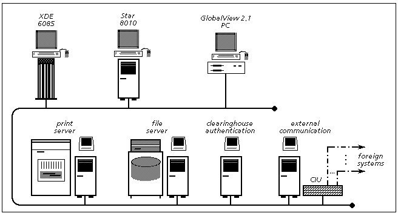
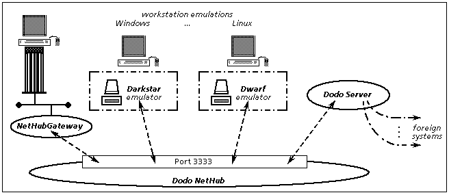

## Dodo Services - XNS with Java

Dodo Services implement **Xerox Network Services** (XNS) protocols in Java, providing XNS
services to existing emulated or real Xerox client machines.
    
Currently the following XNS services are provided by Dodo:
- Time
- Routing Information
- Clearinghouse
- Authentication
- Boot
- Printing
- Filing
- Mailing

(although in most cases the implementation is incomplete regarding the specification,
the services provide a working and useful subset for working "as usual" with XDE resp.
StarOS, ViewPoint or GlobalView resp. Interlisp-D.

In fact, Dodo is not a single Java program, but a set of programs creating a
simple virtual network infrastructure, a kind of XNS-over-TCP/IP. This virtual
network allows different programs to inter-connect, among them the Dodo server proper,
a gateway to a (real) network device and of course the Xerox client machines wanting
to access the server component (see section **Topology**).

As for the maybe exotic name: although Dodo is not based on the Mesa-architecture but
an almost pure Java implementation, the name had to start with the letter *D* to be in
line with the Xerox tradition; on the other hand, it seemed appropriate to be something
that no longer exists or is not noticeably present in the world; so the extinct species
of a flight incapable bird came in mind: the [Dodo](https://en.wikipedia.org/wiki/Dodo).


### Functionality

The Dodo system implements large parts of the Xerox Network Services protocol stack in Java,
providing the functionality to build higher-level things like XNS file or print services.

In the XNS levels terminology, the Dodo system supports resp. implements the
following protocols:

- Level 0    
Ethernet over TCP/IP as transmission media: raw Ethernet packets are relayed by
the *NetHub* program between machines connected to the NetHub; although any ethernet
packets are transported, only packets with ethertype 0x0600 (XNS IDP) are processed
by the Dodo server and thus relevant here (hence narrowed to *XNS-over-TCP/IP*).

- Level 1    
IDP (Internet Datagram Protocol) packet structure, transporting the basic XNS addressing
information

- Level 2    
    - PEX (Packet EXchange)    
    API for both responder (server-side) and requestor (client-side)
    - SPP (Sequenced Packet Protocol)    
    API both server-sockets and client-connections, including the connection close
	protocol (based on sub-sequence types 254 and 255)
    - Echo    
    responder for echo protocol packets
    - Error    
    incoming error packets are dispatched to the local component reported by the sender as
    having produced the problem

- Level 3
    - Time of Day protocol    
    responder for time request broadcasts
    -  Routing Information protocol    
    broadcaster for routing information as well as responder to
    client requests
    - Courier    
    infrastructure for implementing Courier server programs;    
    however no Courier compiler is currently available, so mapping
    the Courier program definitions (.cr files) to the corresponding
    Java constructs must be done manually. 

- Level 4
    - Broadcast for Servers (BfS)    
	responder for Clearinghouse BfS and Authentication BfS requests
    - Boot Service    
	responder providing boot-files (microcode, germ, boot-file) to a requesting
	machine, supporting both the SimpleRequest/SimpleData and SPP variants of the
	boot protocol
    - Clearinghouse (CHS)    
	(Courier program 2, versions 2 and 3)    
	all protocol procedures are implemented for a *read-only* clearinghouse
	database, allowing to log in to XDE, Star/Viewpoint/GVWin and Interlisp-D, to navigate the network
	directory in GlobalView as well to query clearinghouse entries with `Maintain.bcd`
	in XDE; however changes to the	database are rejected
    - Authentication (Auth)    
	(Courier program 14, version 2)    
	all protocol procedures are implemented for a *read-only* clearinghouse
	database, allowing to log in to XDE, Star/Viewpoint/GVWin and Interlisp-D; however changes to the
	database are rejected
    - Printing    
	(Courier program 4, version 3)    
	all protocol procedures are implemented, allowing to print from XDE, Star/Viewpoint/GVWin and
	Interlisp-D as well as to query a print job status, the printer properties and the printer status.    
	The interpress files are received and collected in the output directory,
	a PostScript file can optionally be generated for the interpress master.
	and possibly post-processed.    
	The PostScript generation provides a basic support for western-european
	character sets as well as simple graphics (vector and uncompressed bitmaps),
	giving usable but far from perfect results.
    - Filing    
	(Courier program 10, versions 4,5,6)    
	a large subset of the protocol procedures is implemented, allowing
	to access file drawers, folders and files on Dodo XNS File services from XDE, Star/Viewpoint/GVWin
	and Interlisp-D. Although substantial functionality is missing (like access control
	and access rights), Dodo file services are already usable in a mostly single-user environment.
    - Mailing    
	(MailTransport: Courier program 17, version 4 and 5)    
	(Inbasket: Courier program 18, version 1 and 2)    
	the subset of protocol procedures actively used by XDE and Star/Viewpoint/GlobalView
	for sending and receiving mails is implemented.

The network configuration of a Dodo server instance and the services provided
can be configured through a property file specified when starting the Dodo program.
	
### Topology

The following network example from the "old days" can be used for discussing the Dodo
components:



In a more contemporary environment of emulated Xerox machines, the original Star 8010 workstation
could be subtituted by the Darkstar emulator, the Dwarf emulator could replace the PC with GlobalView.    
But the are still functioning Xerox workstations that may require XNS services, so the 6085 machine will
be assumed to be such a machine.

The above network could be reproduced as follows with the XNS emulation provided by the Dodo
components:



Besides the XNS client systems, at least 2 components need to run as independent programs
for using Dodo services:

- **NetHub**    
this is the backbone of the virtual network, to which all other components connect
with a TCP connection. The NetHub forwards each packet received from one attached
component to the other connected components.    
In a sense, NetHub is the equivalent to the thick yellow coaxial ethernet cable in the 80's
to which each Xerox workstation was connected through a transceiver tapped on the cable.    
NetHub uses a quite simple protocol for communication with connected client components:
the raw ethernet packet to be transmitted is prefixed with a 2 byte big-endian
length information. This protocol is simple enough to be easily implemented in
emulators.    
NetHub listens on port 3333 for client connections (currently hard-coded).

- **Dodo server**    
this is the program providing the XNS services. All supported services (clearinghouse, authentication,
filing, printing etc.) can be provided by a single Dodo server instance, i.e. a single running Dodo server
process, which connects to the NetHub.    
The only exception is printing, as the Courier protocol for printing only supports one printer service
for a server machine, so each *additional* emulated print service therefore requires another Dodo process
(using an own machine-id).    
It is however possible to distribute the provided XNS services over several Dodo server processes connected
to the same NetHub, for example one Dodo server for the clearinghouse, authentication and mail services as
well as the filing volume for desktops and user file drawers, a second for printing and a third for some data
filing volumes. In such a distributed case all Dodo server instances must use the same clearinghouse database
files (shared or identical copies).

Besides programs (emulators and Dodo server) connecting directly to the NetHub, other XNS clients can also use
the Dodo XNS services through the **NetHubGateway**:
this is a NetHub client program that connects to a local PCap network device, implementing
a gateway for XNS packets between a (more or less) real network and NetHub, allowing
to attach emulators or potentially real machines that do not directly implement the
NetHub protocol.

Two additional program components of Dodo services can be used if required:

- **NetSpy**    
this is a "read-only program" connecting to the NetHub with the only purpose to
receive all packets traveling in the virtual network and to dump the packet
content to `stdout`; in addition to the raw packet content, it issues the recognized
packet type specific structural data at the different layers (ethernet, IDP, PEX,
SPP etc. headers, type specific payload).

- **FsUtil**    
this file service utility allows to list folders in a Dodo file service folder, as well as
importing or exporting files from/to the local file system. 

Additional unsupported examples programs show the usage of the Dodo XNS-API for client
and server applications, see [example-programs](./example-programs.md).

### Invocation and usage

#### Prerequisites

The following prerequisites must be installed and possibly configured to
run Dodo services:
- for NetHub, Dodo server, NetSpy, FsUtil:
    - Java 8 JRE or newer
- for NetHubGateway:    
additionally requires the following platform specific (Windows/Linux/...,
32bit/64bit) libraries:
    - PCap (native packet capture library/driver),
    e.g. [WinPCap](https://www.winpcap.org/) for Windows resp.
    [libpcap](https://www.tcpdump.org/))
    - [jNetPcap](https://sourceforge.net/projects/jnetpcap/)
    Java PCap wrapper library

The current binaries for the Dodo services can be found in the file `dist.zip`,
which can be unpacked to the directory `dist`. This directory contains the jar-file
with the Dodo programs (`dodoserver-and-nethub.jar`) with the programs 
described in the following sections, as well as sample `.cmd` files for the
Windows platform, expecting to be invoked in the `dist` directory.    
For using the NetHubGateway, the `jnetpcap.jar` should be copied there, unless
the script `run-nethubgateway.cmd` is adapted to match the location of this
jar-file. The matching native libray for jNetPCap must be on the `PATH` for
being found at runtime.

#### NetHub

The `main`-class for NetHub backbone for the virtual network is:

	dev.hawala.hub.NetHub

and is started with:

`java -cp dodoserver-and-nethub.jar dev.hawala.hub.NetHub`

The sample Windows batch file is: `run-nethub.cmd`.

This program has not command line parameters and listens on port 3333 for
connections from XNS client systems. 


#### Dodo server

The `main`-class for the Dodo server is:

	dev.hawala.xns.DodoServer

and is started with:

`java -cp dodoserver-and-nethub.jar dev.hawala.xns.DodoServer`

The sample Windows batch file is: `run-dodoserver.cmd`

This program uses 2 types of files to configure the functionality provided to the
XNS network:

- a Dodo configuration file (a Java `.properties` file) defining the characteristics
  of the XNS network, the services provided by the Dodo server process and the
  configuration data for these services.    
  If the XNS services are to be provided by several Dodo server processes, e.g.
  one for clearinghouse and a print service, one for file services and one
  further for a second print service, the common definitions can be given in
  a configuration file used by all server processes (through option `-baseCfg:`)
  with main configuration file given for the server defining the specifics for each
  of the server processes.
- an optional machine file giving symbolic names to machine-IDs (processor-ID or MAC
  address in todays wording). The machine names defined here can be used wherever
  a machine-ID is to be given in configuration files, either for the Dodo
  server itself or in the configuration files for the Dodo clearinghouse database
  (see [Clearinghouse configuration](./chs-config-files.md));    
  Another purpose of this file is to override some of the configuration parameters
  for certain client machines of Dodo servers, for example to throttle communication
  for slower (real or emulated) machines like Darkstar clients while allowing faster
  emulated machines in the same network to access Dodo servers as fast as possible.

##### Dodo server command line parameters

The Dodo server program can be invoked without command line parameters, which will
use the following default configuration file names:

- `dodo.properties`    
  for the main server configuration file
- `machines.cfg`    
  for the optional machine name to processor id mappings file; if this file does not
  exist, no machine mappings are used.

This program accepts the following optional parameters:

- _filename_    
  the name of the main `.properties` file to use as configuration for the Dodo server
  instead of `dodo.properties`
- `-basecfg:`_filename_    
  the optional name of the `.properties` file defining the common configuration
  for a set of Dodo server processes providing together the XNS services.    
  All these servers should use the same `-baseCfg` configuration file, the main
  configuration file given for each server defines the specific configuration for
  the corresponding server, overriding or adding configuration items to the common base
  configuration.
- `-machinecfg:`_filename_    
  the name of the machine definitions file to use instead of `machines.cfg`

A sample configuration file `dodo.properties` is available in the directory `dist`.

##### Dodo server configuration file

The following parameters can be specified in the configuration file for defining the basic
communication parameters and the XNS services to be provided:

- `networkNo`    
the (decimal) network number that Dodo server belongs to and which is provided in
time and BfS service responses     
_optional_, _default_: 1025

- `machineId`    
the processor or machine id for the Dodo server machine (or MAC address in todays wording)  
(it should be ensured that **all** machines on the network have an unique processor id,
or Pilot-based machines will stop by entering 0915 state)    
_optional_, _default_: `10-00-FF-12-34-01`

- `netHubHost`    
the name of the NetHub host to connect to    
_optional_, _default_: `localhost`

- `netHubPort`    
the port where the NetHub is listening (must be in range 1..65535)    
_optional_, _default_: `3333`

- `startEchoService`    
do start Dodo's Echo service?    
_optional_, _default_: `true`

- `startTimeService`    
do start Dodo's Time service?    
_optional_, _default_: `true`

- `startRipService`    
do start Dodo's Routing Information Protocol service?    
_optional_, _default_: `true`

- `startChsAndAuthServices`    
do start Dodo's Clearinghouse service and Authentication service? (both can only
be started (or not) together, as they serve the same domain jointly)    
_optional_, _default_: `true`

- `startBootService`    
do start Dodo's Boot service?    
_optional_, _default_: `false`

- `localTimeOffsetMinutes`    
time zone parameter for the time service as
difference between local time and GMT in minutes, with positive values being
to the east and negative to the west (e.g. Germany is 60 without DST and 120
with DST, whereas Alaska should be -560 without DST resp. -480 with DST)    
_optional_, _default_: 0 (i.e. GMT)

- `daysBackInTime`    
number of days to subtract from the current date to get the final timestamp
in the time service    
_optional_, _default_: `0` (i.e. no date change)

- `organization`    
`domain`    
`chsDatabaseRoot`    
`allowBlanksInObjectNames`    
`authSkipTimestampChecks`    
these 5 properties define the Clearinghouse service provided by this
Dodo instance;    
see [Clearinghouse configuration](./chs-config-files.md) for details

- `bootService.baseDir`    
`bootService.verbose`    
`bootService.simpleDataSendInterval`    
`bootService.sppDataSendInterval`    
these 4 properties configure the boot service provided by this Dodo instance;    
see [Boot service configuration](./bootsvc-configuration.md) for details

- `printService.name`    
`printService.outputDirectory`    
`printService.paperSizes`    
`printService.disassembleIp`    
`printService.ip2PsProcFilename`    
`printService.psPostprocessor`    
these 6 properties define the Printing service provided by this
Dodo instance;    
see [Print service configuration](./printsvc-configuration.md) for details

-  `fileService.NN.name`    
`fileService.NN.volumePath`    
a set of these parameter pairs (with the numerical *NN* parts being a sequence starting with 0)
define the file services provided by this Dodo instance;    
see [File service configuration](./filesvc-configuration.md) for details

- `mailService.volumePath`    
defining the mail storage filing volume with this parameter starts the mail service in this Dodo instance;    
see [Mail service configuration](./mailsvc-configuration.md) for details

The following parameters can be specified in the configuration file to control the communication
at the packet level:

- `useChecksums`    
specifies if checksums are to be verified resp. generated at IDP level    
_optional_, _default_: `true`

- `ether.useDarkstarWorkaround`    
if `true`: activate a work-around for a problem in _Darkstar_ where IDP packets having the correct
ethernet packet length for the IDP length may be ignored. The work-around is to add 2 extra words to
the ethernet packet.     
_optional_, default: `false`

- `spp.sendingTimeGap`    
milliseconds to wait before transmitting next packet in an SPP connection after having sent a packet
in the same connection.
_optional_, default: `5`

- `spp.resendDelay`    
milliseconds before sending the acknowledge-request on missing acknowledge after having sent a packet,
initiating the server side resend standard procedure.    
_optional_, default: `20`

- `spp.handshakeCheckInterval`    
interval in milliseconds for the count down stepping in the SPP handshake check cycles;
a SPP packet resend cycle or an acknowledge send is initiated when the corresponding counter of a
specific connection reaches `0`.    
_optional_, default: `10`

- `spp.handshakeSendackCountdown`    
number of check intervals after receiving the others send-ack before sending the servers ack packet,
giving the local service some processing time to react on the ingone data and sending result
data packets before the ack-packet is sent to the client side    
_optional_, default: `4 ` (giving 30..40 ms before a requested ack is sent)

- `spp.handshakeResendCountdown`    
number of check intervals after sending a server-side request for acknowledgment before
starting to resend packets if no acknowledge arrives from the client in the meantime.    
_optional_, default: `50` (giving the other side about 500 ms to respond to a send-ack)

- `spp.handshakeMaxResends`    
max. number of resend cycles without response from the client side before the
connection is considered dead and hard-closed on the server side.    
_optional_, default: `5`

- `spp.resendPacketCount`    
max. number of packets (starting with the oldest i.e. lowest sequence number) in
one resend cycle.    
_optional_, default: `2`

##### Dodo server machine ids file

The symbolic name for both a Dodo server and client machine processor-id is defined 
in the machine ids file with a single line as follows:

_name_ = `XX-XX-XX-XX-XX-XX`

The symbolic name can be used in configuration files for Dodo and the clearinghouse
database files at any place where a machine or processor id is expected. If an
undefined machine name is used in a configuration file, a dummy processor id is used
for that name, allowing to continue loading the configuration file(s) and possibly
collect further undefined symbolic machine names, but the server is not started
after processing all configuration files and the undefined machine names are listed
to `stdout`. 

(as usual empty lines and lines with `#` as the first non-blank character are
ignored)

For a client machine, the above definition line is the anchor for adding configuration
parameters specifically for this machine, overriding the default defined for the Dodo server.
Following the definition line, the parameters for this machine are given one per line
introduced with a `+`, for example:

```
#
# slow down for a Darkstar machine running a Pilot-OS (XDE, StarOS or ViewPoint)
#
darkstar-1 = 10-00-AA-10-00-11
+ authSkipTimestampChecks = true
+ spp.resendDelay = 60
+ spp.sendingTimeGap = 60
```

The following configuration parameters can be specified for a machine in a machine
ids file to override the global settings:
- `authSkipTimestampChecks`
- `bootService.simpleDataSendInterval`
- `bootService.sppDataSendInterval`
- `spp.sendingTimeGap`
- `spp.handshakeSendackCountdown`
- `spp.resendDelay`
- `spp.handshakeResendCountdown`
- `spp.handshakeMaxResends`
- `spp.resendPacketCount`

(other configuration parameters are ignored)

If several client machines need the same parameter overrides, it is not necessary
to duplicate the parameters, instead it is possible to copy the settings from another
machine with a line: `:like `_other-machine_

For example:

```
#
# the second Darkstar machine
#
darkstar-2 = 10-00-AA-10-00-12
:like darkstar-1
```

#### NetHubGateway

The `main` class for the NetHubGateway is:

	dev.hawala.hub.NetHubGateway
	
and is started with:

`java -cp dodoserver-and-nethub.jar;jnetpcap.jar dev.hawala.hub.NetHubGateway` [*options*]

The sample Windows batch file is: `run-nethubgateway.cmd`

This program has the following optional parameters:

Parameter|Default|Description
---------|-------|-----------
(*1st arg*)| `localhost`| host where the NetHub runs, `=`selects the default
(*2nd arg*)| `3333` | port for the NetHub on the NetHub host, `=`selects the default
(*3rd arg*)| `MS LoopBack Driver` | PCap name of the network device to gateway, `=`selects the default
`-ld`| | Log packet coming from the network device
`-ldd`| | Log packet coming from the network device with packet content
`-lh`| | Log packet coming from the NetHub
`-lhd`| | Log packet coming from the NetHub with packet content
`-p`| | print the list of PCap device names on the local machine instead of running the gateway
`-h` | | print the command line help and stop 

#### NetSpy

The `main`-class for NetSpy is:

	dev.hawala.hub.NetSpy
	
and is started with:

`java -cp dodoserver-and-nethub.jar dev.hawala.hub.NetSpy` [pcap-logfile]

The sample Windows batch file is: `run-netspy.cmd`

This program always connects to port 3333 on `localhost`.

If the optional commandline parameter is given, it specifies the target filename where to additionally
log all packets in the LibPCap format. This output file can be used for further offline analysis.    
For example creating such a dump and writing the content can for example be done with:

	java -cp dodoserver-and-nethub.jar dev.hawala.hub.NetSpy netspy-pcap.dump
	tcpdump -ttttnn -r netspy-pcap.dump

#### FsUtil

The `FsUtil` program allows to list the contents of a Dodo file service volume and to copy files between
the local file system and a file service volume. FsUtil accesses manipulates the volume directly on the local
file system, so no XNS login is required.

The `main`-class for FsUtil is:

	dev.hawala.xns.FsUtil

and is started with:

`java -cp dodoserver-and-nethub.jar dev.hawala.xns.FsUtil` _parameters_

The sample Windows batch file is: `fsutil.cmd`

FsUtil has the following command line options:

- `fsutil`&nbsp;&nbsp;_volume_&nbsp;&nbsp;&nbsp;_path-to-folder_&nbsp;&nbsp;`ls` [`-r`]
- `fsutil`&nbsp;&nbsp;_volume_&nbsp;&nbsp;&nbsp;_path-to-folder_&nbsp;&nbsp;`dump` [`-r`]
- `fsutil`&nbsp;&nbsp;_volume_&nbsp;&nbsp;&nbsp;_path-to-folder_&nbsp;&nbsp;`export` [`-r`]
- `fsutil`&nbsp;&nbsp;_volume_&nbsp;&nbsp;&nbsp;_path-to-folder_&nbsp;&nbsp;`import` _src1_ [_src2_ ...]

The _volume_ argument specifies the directory for the file service volume in the local file system.

The _path-to-folder_ argument specifies the folder in the volume to work with and must be given from the
volume root, i.e. starting with the file drawer name. The folder or file versions (e.g. _folder-name_`;1`)
are optional and need only to be specified for items having a different version than `1`.

FsUtil has the following subcommands:

- `ls`    
do a terse list of the folder content to stdout, having one line per item with creation date,
item type, size in bytes and item name with version; it `-r` is given, the subfolder hierarchy is
also issued, with each folder level indented.
  
- `dump`    
do a verbose list of the folder content (navigating the subfolder hierarchy if `-r` is given), writing
3 lines with the following item attributes:
    - full path to the item
    - file-id, name, version, creation time, type, checksum, data-site, stored-size
    - byte-size, created-by, read-by, modified-by

- `export`    
copy all file items from the specified folder to the current directory in the local file system; if `-r`is
given, the folder hierarchy below the specified folder will be included and a corresponding directory
structure is created; care should be taken if items appear in multiple versions, as files with same name
will overwrite (only the last exported version will persist) and folder content will be merged.

- `import`    
copy the items _src1_, _src2_, ... from the local file system into the volume folder; if a directory is
given, a folder is created for the directory and the items in the directory are (recursively) imported
to this folder.

**Remark**: as only one program at a time can work with a volume directory to prevent data loss in the Dodo file
service volume, `FsUtil` can only be used if no Dodo server instance is running a file service on the volume.

**Examples**:

List the files in folder `test/vp-documents` of the file service volume directory `../dodo-services/vol-fs1`:

	fsutil ../dodo-services/vol-fs1 test/vp-documents ls

Import all files in the local directoy `old-docs` into the folder `test/vp-documents` of the file
service volume directory `../dodo-services/vol-fs1`, creating a new subfolder `old-docs`:

	fsutil ../dodo-services/vol-fs1 test/vp-documents import old-docs

Export all files in the folder `test/vp-documents/archive` including all subfolders of the same volume
to the current directory:

	fsutil ../dodo-services/vol-fs1 test/vp-documents/archive export -r


### Environments known to work

Dodo was successfully tested in several environments with different emulators, with
"successful" meaning that it was at least possible to log on to the Xerox operating system
and optionally to verify that Clearinghouse entries can be searched resp. queried,
e.g. under XDE using the `Maintain.bcd` program or by navigating the network
directory under GlobalView (see the examples section in the
[clearinghouse configuration](./chs-config-files.md) document. For Printing and Filing services
the client OS typical operations (XDE: print.bcd, FileTool with Retrieve!, Store! Remote-Delete!,
GVWin: printing documents, copy/move/props on remote files, documents and folders) are routinely
tested.

The following environments were tested with Dodo server and nethub, using the
default Clearinghouse database found in `dist.zip`:

- [Dwarf](https://github.com/devhawala/dwarf) emulator on Windows (Vista and newer) and Linux-Mint on a Core2Duo 2.4 GHz    
both XDE and GlobalView work; all components (Dwarf, Dodo server and nethub)
run on the same (hardware) machine

- [Guam-Emulator](https://github.com/yokwe/mesa-emulator) by Yasuhiro Hasegawa with an experimental NetworkAgent
on a Core2Duo 2.4 GHz with Linux Mint; the emulator's NetworkAgent was modified for directly
connecting to a local Nethub; connection to Dodo was tested with XDE

- Don Woodward's [Dawn](http://www.woodward.org/mps/)-emulator with Dawn's XNS driver and XDE disk    
The following configuration was used:
    - real hardware: Laptop with 2.4 GHz Core2Duo processor
	- ... running Windows-Vista 32 bit as host OS
    - Windows 2000 installed in a MS VirtualPC virtual machine
	- ... with the Dawn XNS protocol driver installed
	- ... running the Dawn emulator with the Dawn XDE disk
	- ... the virtual machine connected to the network through the MS Loopback adapter
	- NetHub with NetHubGateway and Dodo server running on the host OS

- BSD 4.3    
Starting with this vintage OS version, BSD had support for XNS protocols for a while, until
the XNS support was removed due to missing maintainers. Besides the kernel support for XNS
protocols, a set of programs to access XNS services (also to provide some services) is
available, which had to be built manually.    
The test environment was a network-capable SIMH emulation for VAX running the
[Uwisc-4.3BSD](https://sourceforge.net/projects/bsd42/files/4BSD%20under%20Windws/v0.3%20Beta%201/)
system (a meanwhile outdated beta version).   
BSD 4.3 has the program `xnsbfs` allowing to do the Broadcast for Servers request (either for
clearinghouse ot authentication servers) and then invoke the "list domains served" Courier
request.    
Other XNS programs in BSD 4.3 were not tested so far.

- [Darkstar](https://github.com/livingcomputermuseum/Darkstar) (8010 emulator version 1.0.0.1 by Josh Dersch / Living Computer Museum)    
Tested under Windows-10, Darkstar running Viewpoint 2.0.6, Star OS 5.0 or Interlisp-D (Lyric or Medley 1.0 releases),
connected either with NetHubGateway (for Darkstar 1.0.0.1) or directly (since Darkstar 1.1.9.0).    
The network speed is comparable with real 8010's for workstations and servers (i.e. slow as in the 80's)
(Darkstar running in average at 100~130% speed according to the status line). For reliable network connections,
the option `ether.useDarkstarWorkaround` should be set to `true` (see above) and the (internal
low-level) option `spp.sendingTimeGap` (milliseconds between packets of the same SPP connection) should
be set to a value between 50 to 75 for throttling Dodo's transmission rate, depending on Darkstars emulation speed.    
Setting time from network at 0937 does not work for unknown reasons,
so setting Dodo's `authSkipTimestampChecks` configuration parameter to `true` is
required for authentication with CHS/Auth and accessing the XNS network.    
Besides this, using Dodo file and print services with Darkstar works for Viewpoint 2.0.6, Star OS 5.0 and Interlisp-D (Star OS 5.0
can be installed on Darkstar from the floppy set [Star-4.3.zip](http://bitsavers.org/bits/Xerox/8010/Star-4.3.zip) at
Bitsavers, which contains version 5.0 despite the name)    
Using file services with Star OS 5.0 may be a bit unreliable, as some aspects of version 4 for the Filing protocol had to
be reconstructed from courier data streams issued by Star OS (resp. guessed for response structures), because the `Filing4.cr`
files found in the internet assume some structures to be same as in newer filing versions, which is clearly wrong
in certain cases. Some operations still may not work, but important things do.    
Using Interlisp-D with Darkstar requires further low-level tweaks to the SPP configuration (see the sample `machine.cfg`
in the file `dist.zip`).     
Remark: Darkstar version 1.1.0.0 initially had a broken network support, as ethernet packets are sent over the network
but received packets are not relayed to the emulator (the necessary line appears to have been removed accidentally
along with some logging line cleanups during commit "Small tweaks, updated readme"). Darkstar version 1.0.0.1
as well as the updated version 1.1.0.0 (of 2020-11-18) have a working network interface, so these versions should be
used if networking is intended. Using Darkstar version 1.1.9.0 is however recommended, as it allows direct connections
to the NetHub (instead of going through the NetHubGateway).


### Bibliography

- source code for XNS support in BSD 4.3    
the following are different versions of the XNS implementation for VAX BSD at Cornell University
in the 80's; besides important insights into XNS implementation details, these archives provide
Courier program declarations ('.cr' files) for many XNS services (but some important protocols are
still missing, like Mail protocols) 
    - [https://stuff.mit.edu/afs/athena/astaff/reference/4.3network/xns/](https://stuff.mit.edu/afs/athena/astaff/reference/4.3network/xns/)
    - [courier.4.3d.tar.Z](http://bitsavers.informatik.uni-stuttgart.de/bits/Xerox/XNS/courier.4.3d.tar.Z)

- several documents at [bitsavers](http://bitsavers.informatik.uni-stuttgart.de/pdf/xerox/), e.g.:
    - [Xerox_System_Network_Architecture_General_Information_Manual_Apr85](http://bitsavers.informatik.uni-stuttgart.de/pdf/xerox/xns/XNSG_068504_Xerox_System_Network_Architecture_General_Information_Manual_Apr85.pdf)
    - [Xerox_Office_System_Technology_Jan1984](http://bitsavers.informatik.uni-stuttgart.de/pdf/xerox/8010_dandelion/OSD-R8203A_Xerox_Office_System_Technology_Jan1984.pdf)
    - [Courier_The_Remote_Procedure_Call_Protocol_Dec1981](http://bitsavers.informatik.uni-stuttgart.de/pdf/xerox/xns/standards/XSIS_038112_Courier_The_Remote_Procedure_Call_Protocol_Dec1981.pdf)    
    (Dodo's Courier infrastructure was almost done when this document was uploaded to bitsavers, but it confirmed the implementation concepts derived from the BSD 4.3 source codes)
    - [Authentication_Protocol_Apr1984.pdf](http://bitsavers.informatik.uni-stuttgart.de/pdf/xerox/xns/standards/XSIS_098404_Authentication_Protocol_Apr1984.pdf)
    - [Clearinghouse_Entry_Formats_Apr1984.pdf](http://bitsavers.informatik.uni-stuttgart.de/pdf/xerox/xns/standards/XSIS_168404_Clearinghouse_Entry_Formats_Apr1984.pdf)
    - [Services_8.0_Programmers_Guide_Nov84.pdf](http://bitsavers.informatik.uni-stuttgart.de/pdf/xerox/xns_services/services_8.0/Services_8.0_Programmers_Guide_Nov84.pdf)
    - [Filing_Protocol_May1986.pdf](http://bitsavers.informatik.uni-stuttgart.de/pdf/xerox/xns/standards/SNSS_108605_Filing_Protocol_May1986.pdf)
    - [Services_8.0_Filing_Programmers_Manual_Nov84.pdf](http://bitsavers.informatik.uni-stuttgart.de/pdf/xerox/xns_services/services_8.0/Services_8.0_Filing_Programmers_Manual_Nov84.pdf)
    - [Boot_Service_10.0_1986.pdf](http://bitsavers.informatik.uni-stuttgart.de/pdf/xerox/xns_services/services_10.0/Network_Shared_Services_10.0/610E02850_Boot_Service_10.0_1986.pdf)

### Development history

- 2022-11-06    
-- MS: refined Courier structures based on the definitions in the Medley LAFITE mailclient (see [interlisp.org](https://github.com/Interlisp)-project    
-- MS: fixes to implementation of new mail protocols (MailTransport 5 and Inbasket 2)    
-- PS: improved the work-around for Interlisp-D produced Interpress bitmaps

- 2022-10-15    
-- FS: implemented Courier proc 'replaceBytes' (for Interlisp-D/Medley)

- 2022-10-09    
-- Echo: bugfix (echo-ed packets now contain the content of the request packet)    
-- NetSpy: now optionally also log packets into a file in LibPCap format

- 2022-09-18 - Support for Interlisp-D    
-- FS: Courier procs 'retrieveBytes' (impl.) and 'changeControls' (dummy)    
-- PS: extended IP-to-PS transformation for Interlisp-D-style IP usage    
-- PS: escape cmd/shell-relevant chars when calling PS postprocessor    
-- SPP: prevent ingoing 'resource-limit' error packets from closing SPP connections

- 2022-05-11    
-- removed option `strongKeysAsSpecified`    
-- added option `allowBlanksInObjectNames` for clearinghouse object names    
-- FS: (bugfix) file service names with uppercase letters no longer result in "serviceUnavailable"    
-- MS: (bugfix) session data for GVWin mailing is now dropped after mail was posted    
-- `dist.zip`: added pre-configured bootservice and fileservice allowing to install from floppy with Draco

- 2022-03-28    
-- MS: added support for GlobalView-Mailing (restricted to pre-GlobalView functionality)    
-- Courier: skip the End-of-Message in version exchange sent by Interlisp-D during connection initialization

- 2021-04-19, 2021-04-19    
-- FsUtil: added several character substitutions in document names on export    
-- FsUtil: fixed wrong printf-format 

- 2021-01-24    
-- PS: added support for Xerox PFB fonts from GlobalView 2.1 when generating PostScript for PDF

- 2020-12-26 - **Important corrections to File Service -- update Dodo ASAP**    
-- FS: bugfix preventing data loss when storing VP documents (MP 0915 on re-opening document in VP)    
-- FS: bugfix preventing losing files with strange VP access rights when opening volume on Dodo restart

- 2020-11-23    
-- added first version of an XNS Mail service, allowing to exchange mails between StarOS, ViewPoint and XDE    
&nbsp;&nbsp;&nbsp;&nbsp;(but: GlobalView is currently not supported by the Dodo Mail service)    
-- reworked the sample environment (`dist.zip`) to provide mailing, have a `machine.cfg` file and additional scripts    
-- added Filing session prologations for potentially long running operations (e.g. store or retrieve)

- 2020-10-03    
-- added machine ids file to simplify configuration and define machine specific configurations    
-- new parameter bootService.sppDataSendInterval    
-- documented command line options and packet level configuration parameters for the Dodo server process

- 2020 August/September    
-- Dodo: improved support for Darkstar client machines    
-- FS: reworked Filing version 4 to correct wrong Courier structures defined in `Filing4.cr` files found in the internet to allow Star OS 5.0 to access file services

- 2020-02-29    
-- Dodo: added boot service (optional)    
-- CHS: added _workstation_ as chs object    
-- CHS: lists of objects or aliases are now returned sorted alphabetically    
-- FS: implemented operations Move(), Copy(), Find() (and _dummy_ GetControls())    
-- FS: added FsUtil program for list, export, import files from/to folders in a volume    
-- FS bugfix: prevent session timeout for long Serialize()/Deserialize() operations    
-- FS bugfix: the ordering attribute is now saved correctly in the metadata of a file    
-- SPP bugfix: close protocol packets are now sent with incrementing sequence number

- 2019-07-08    
bugfix: (Courier-connection) if the client supports more than one protocol version, the server
must first send the own supported versions before awaiting the first remote procedure call

- 2019-06-13    
optimization: all file items created in a Deserialize operation (procedure 16) are created in
a single Volume modification session, reducing the number of metadata delta files

- 2019-06-09    
-- reworked acknowledge and resend machinery for SPP connections    
-- added config parameters (development only) for SPP connections control (acks and packet resends)    
-- fine-tuned SPP parameters to reduce resends in general, preventing flooding Darkstar with resends in particular    
-- serialized file operations now use a specific implementation equivalent for `StreamOf<UNSPECIFIED>` with a much smaller heap footprint and probably faster.    
-- bugfix: corrected bulk data transfer to prevent file content retrieves to be rounded up to even byte count length (for XDE)    
-- bugfix: corrected handling for abort of file content transmission by client (for XDE)    
-- added configuration to time service for response throttling (intended for Darkstar, but did not help setting time at 0937)

- 2019-05-13    
bugfixes to file service    
-- properties sheet for root file drawers now works    
-- properties sheet for objects with an 'createdBy' which is not a full 3-part-name (e.g. "catalogImpl") now works

- 2019-05-11    
added first limited but working version of xns filing services    
added configuration parameter 'authSkipTimestampChecks' for authentication with strong credentials

- 2019-01-30    
added optional PostScript generation and post-processing to the xns print service    
added new documentation page for printing service configuration    
moved parts of the Dodo clearinghouse configuration to the already existing documentation page

- 2019-01-22    
added minimal xns print service

- 2019-01-17    
added 2 example programs demonstrating the usage of the XNS-API (see [example-programs](./example-programs.md))

- 2019-01-06    
routing information protocol: extended to broadcast routing data on a regular as well as
event driven base    
clearinghouse service: all courier procedures are now implemented, allowing to query all CHS entries,
however modifications are rejected as the CHS database is read-only    
authentication service: all courier procedures are now implemented, allowing to log in to XDE (simple
credentials) and to GlobalView (strong credentials), however modifications are rejected as the CHS database
is read-only    
bugfix: ethernet packets now have a minimal length of 60 bytes (smaller packets are silently
ignored by Pilot)    
bugfix: SPP now automatically re-sends packets if not acknowledged (even if output queue still
has space)    
bugfix: sending packets by a single SPP connection is throttled to prevent packet losses at
the recipients side (avoid packet resends)    
bugfix: a time shift defined with configuration parameter `daysBackInTime` is applied to
all timestamps issued and used by Dodo server (i.e. also when generating and checking expiration
timestamps for credentials)

- 2018-11-01    
introduced simple read-only clearinghouse database (set of property files, defining users, groups and services), currently only used for authentication    
switch login functionality to use the clearinghouse database    
experimental support for strong credentials creation    
made starting of Dodo services configurable, e.g. for using Dodo only as Time server    
bugfix: overflow when computing password hashes for simple credentials    
bugfix: serialization error for strings at end of courier messages ("authentication service not available")

- 2018-10-12    
added configuration file for Dodo program    
minor code unifications in Courier infrastructure    
(not yet used extensions to Courier authentication and clearinghouse definitions)

- 2018-09-10    
Initial commit to Github    
basic XNS infrastructure    
minimal XNS Clearinghouse/Authentication services to allow login in XDE with simple authentication

- development started about September 2016, but was interrupted in favour of the Dwarf emulator
from January 2017 to about February 2018    
(as all hobby developments it is intermittent and restricted to the free time left over by other important
things like work and private life)

### License

Dodo is released under the BSD license, see the file `License.txt`.

### Disclaimer

All product names, trademarks and registered trademarks mentioned herein and in the
source files for the Dodo programs are the property of their respective owners.
